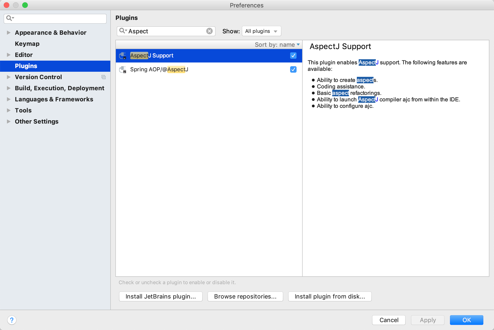
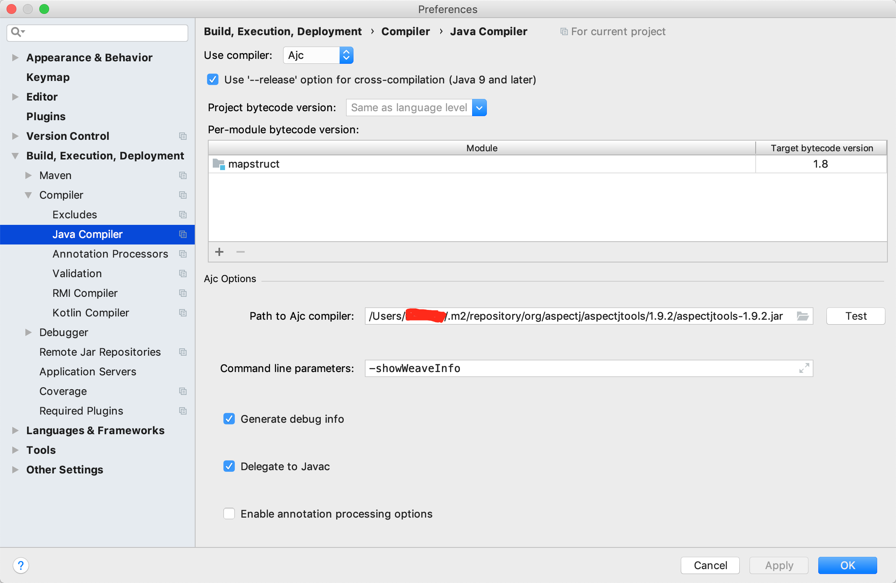
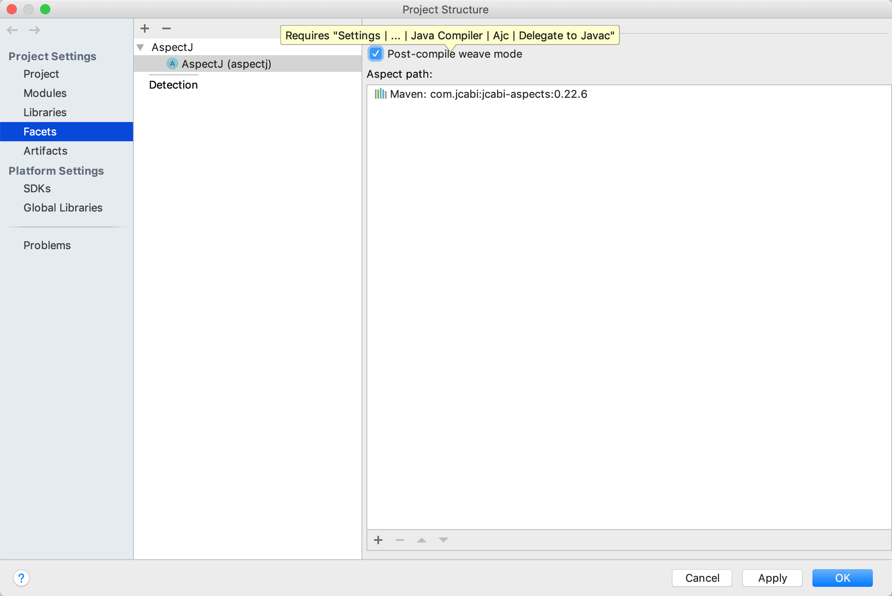

## MapStruct

In the generated method implementations all readable properties from the source type (e.g. Car) will be copied into the corresponding property in the target type (e.g. CarDto). If a property has a different name in the target entity, its name can be specified via the @Mapping annotation.

The property name as defined in the JavaBeans specification must be specified in the @Mapping annotation, e.g. seatCount for a property with the accessor methods getSeatCount() and setSeatCount().

When using Java 8 or later, you can omit the @Mappings wrapper annotation and directly specify several @Mapping annotations on one method.

Collection-typed attributes with the same element type will be copied by creating a new instance of the target collection type containing the elements from the source property. For collection-typed attributes with different element types each element will be mapped individually and added to the target collection

MapStruct takes all public properties of the source and target types into account. This includes properties declared on super-types.


### Sonar Warning

```java
@Mapper
public interface CarMapper {  //NOSONAR
    CarMapper INSTANCE = Mappers.getMapper( CarMapper.class );
}
```

```java

@Mapper
@SuppressWarnings("squid:S1214")
public interface CarMapper { 
    CarMapper INSTANCE = Mappers.getMapper( CarMapper.class );
}
```

### Idea Setup






